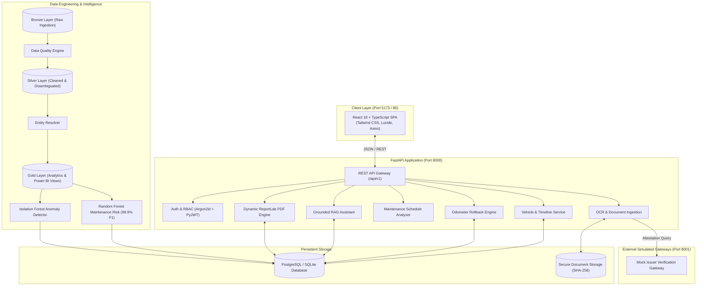

# CarTrust AI — Used-Car Intelligence Platform

[]()
[]()
[]()
[]()
[]()

> **CarTrust AI** is a portfolio-grade, production-style used-car intelligence platform engineered to eliminate information asymmetry in secondary automotive markets. Built upon strict data provenance, cryptographic evidence verification, medallion data pipelines, machine learning risk engines, and a zero-hallucination grounded AI assistant.

---

## 🏛️ Core Principles & System Truths

1. **Truth in Evidence**: CarTrust AI **never** claims, fabricates, or assumes vehicle history facts not established by verified evidence.
2. **Explicit Verification States**: Every recorded event has a defined status:
   - `VERIFIED`: Confirmed directly with an accredited external issuer or public authority gateway.
   - `DOCUMENT_CHECKED`: Extracted and verified via structural OCR and cryptographic hash, pending issuer confirmation.
   - `PARTIALLY_VERIFIED`: Provider matched with minor variance in amount or metadata.
   - `UNVERIFIED`: Uploaded receipt without third-party attestation.
   - `INCONSISTENT`: Conflicts detected against registry or timeline history.
   - `REJECTED`: Proven fraudulent, altered, or invalid.
3. **Zero-Hallucination AI**: The Grounded RAG assistant explicitly states when an item (e.g. clutch replacement, timing belt service) has no recorded evidence rather than guessing or fabricating advice.
4. **End-to-End Execution**: Every frontend interaction connects to live REST APIs, persistent relational storage, dynamic PDF compilation, and real ML inference models.

---

## 📐 System Architecture



---

## 🌟 Feature Matrix

| Feature Module | Capabilities |
|---|---|
| **Indian Number Plate Search & Validation** | Full support for Indian vehicle plates (`MP04AB1234`, `DL01AB1234`, `MH12CD5678`, `22BH1234AA`). Automatic normalization of lowercase, spaces, and hyphens. Live format validation and duplicate registration prevention. |
| **Google Authentication & Secure Onboarding** | Sign in / register seamlessly with Google accounts or email/password. Zero-blank-screen robust error handling with React ErrorBoundary. |
| **Comprehensive Vehicle Onboarding** | Complete multi-step vehicle registration form (Registration plate, make, model, variant, manufacturing year, registration year, fuel, transmission, efficiency, odometer, engine, price, location, RC details). |
| **Vehicle Intelligence & Trust Score** | Multi-factor composite scoring (Odometer Integrity, Maintenance Consistency, Damage History, Evidence Confidence). |
| **Odometer Rollback Anomaly Engine** | Detects mileage drops, flags impossible km/day velocities, assigns statistical severity ratings. |
| **Maintenance Gap Analysis** | Compares service history against manufacturer intervals (oil, brakes, timing belts, spark plugs). |
| **OCR & Document Ingestion** | Uploads PDFs/images, extracts tax invoices via deterministic parsing, computes SHA-256 cryptographic fingerprints. |
| **Issuer Gateway Attestation** | Independent simulated third-party verification query against workshop/issuer databases. |
| **Grounded RAG AI Assistant** | Context-aware chat with strict citations, confidence levels, and explicit "no evidence" honesty guardrails. |
| **Dynamic PDF Intelligence Reports** | Multi-page ReportLab PDF generation with security seals, charts, timelines, and audit hashes. |
| **Side-by-Side Comparison** | Compares 2–3 vehicles side-by-side across scores, maintenance gaps, mileage, and spend. |
| **Admin Governance & Audit** | Real-time telemetry, Data Quality violation tracking, manual evidence moderation queue, and immutable audit logs. |
| **Medallion Data Pipeline** | Automated Bronze $\rightarrow$ Silver $\rightarrow$ Gold transformations with Power BI SQL analytical views. |
| **Machine Learning Suite** | Random Forest maintenance risk classifier and Isolation Forest record anomaly detector. |

---

## 🚀 Quickstart

### Option 1: Native 1-Command Startup (Recommended for Local Dev)

Ensure you have Python 3.10+ and Node.js 18+ installed.

```bash
# Clone and enter directory
cd cartrust-ai

# 1-Command automated runner: initializes DB, seeds demo data, and boots all 3 services
python scripts/run_local.py
```

This starts:
- **Frontend SPA**: [http://localhost:5173](http://localhost:5173)
- **FastAPI Backend & Swagger**: [http://localhost:8000/docs](http://localhost:8000/docs)
- **Mock Issuer Gateway**: [http://localhost:8001/docs](http://localhost:8001/docs)

---

### Option 2: Multi-Container Docker Compose

```bash
# Build and start all services (PostgreSQL, Backend, Frontend, Mock Issuer)
docker compose up --build -d

# Initialize database schema and seed canonical demo data
docker compose exec backend alembic upgrade head
docker compose exec backend python scripts/seed_demo.py
```

- **Frontend SPA**: [http://localhost:80](http://localhost:80)
- **Backend API Docs**: [http://localhost:8000/docs](http://localhost:8000/docs)

---

## 🔑 Canonical Demo Credentials

The platform is pre-seeded with canonical accounts representing key personas:

| Persona | Email | Password | Role |
|---|---|---|---|
| **Vehicle Buyer** | `customer@cartrust.demo` | `DemoPassword123!` | `BUYER` |
| **Workshop Mechanic** | `mechanic@cartrust.demo` | `DemoPassword123!` | `SERVICE_CENTER` |
| **Platform Administrator** | `admin@cartrust.demo` | `DemoPassword123!` | `ADMIN` |

### Canonical Demo Vehicles
Searchable directly by Indian registration number (e.g. `mp 04 ab 1234` or `MP04AB1234`):

- **`MP04AB1234` / `DEMO-VIN-HC-2019-001` (2019 Honda Civic)**: Clean vehicle, high Trust Score (94/100), full service history, verified invoices. Location: Bhopal, MP.
- **`DL01XY5678` / `DEMO-VIN-SW-2020-002` (2020 Maruti Suzuki Swift)**: **Odometer Rollback Demo** (-13,500 km rollback detected with high severity alert). Location: New Delhi.
- **`HR26CR9900` / `DEMO-VIN-CR-2018-003` (2018 Hyundai Creta)**: **Sparse History & Structural Damage Demo** (3-year service gap, major collision claim, high ML risk). Location: Gurugram, HR.
- **`KA05MN9988` (2022 Tata Motors Nexon)**: Newly onboarded vehicle with complete RC and milestone records. Location: Bengaluru, KA.

---

## 🧪 Automated Testing

CarTrust AI includes automated unit and integration tests covering authentication, vehicles, rollback anomalies, document OCR, issuer attestation, grounded RAG honesty, and data pipelines:

```bash
# Run full automated test suite
pytest tests -v

# Run frontend build check
cd frontend && npm run build
```

*All 16 tests execute and pass out-of-the-box.*

---

## 🔄 Data Pipeline & ML Execution

To re-run the end-to-end data pipeline or retrain machine learning models:

```bash
# 1. Generate synthetic raw data (1,000 vehicles, 1,400+ service events)
python scripts/generate_synthetic_data.py

# 2. Execute Bronze -> Silver -> Gold Medallion Pipeline
python pipelines/transformations/run_pipeline.py

# 3. Create Power BI Gold Analytical SQL Views
python pipelines/transformations/create_powerbi_views.py

# 4. Retrain Machine Learning Models
python ml/training/train.py
```

---

## 📚 Technical Documentation

- 📖 **[Architecture Overview](file:///C:/Users/ASUS/.gemini/antigravity/scratch/cartrust-ai/docs/architecture.md)** — High-level system design and technology choices.
- 🔌 **[REST API Reference](file:///C:/Users/ASUS/.gemini/antigravity/scratch/cartrust-ai/docs/api.md)** — Complete endpoint specifications.
- 🗄️ **[Data Model & Schema](file:///C:/Users/ASUS/.gemini/antigravity/scratch/cartrust-ai/docs/data-model.md)** — ER diagram, data dictionary, and 32 normalized tables.
- 🔒 **[Security Architecture](file:///C:/Users/ASUS/.gemini/antigravity/scratch/cartrust-ai/docs/security.md)** — Argon2id, JWT rotation, RBAC, and evidence checksums.
- 🧪 **[Testing Strategy](file:///C:/Users/ASUS/.gemini/antigravity/scratch/cartrust-ai/docs/testing.md)** — Test suite layout, coverage, and execution guide.
- 🎬 **[13 Demo Scenarios](file:///C:/Users/ASUS/.gemini/antigravity/scratch/cartrust-ai/docs/demo.md)** — Step-by-step walkthrough of all platform capabilities.
- 🚀 **[Deployment Guide](file:///C:/Users/ASUS/.gemini/antigravity/scratch/cartrust-ai/docs/deployment.md)** — Local, Docker, and Azure cloud deployment.
- ☁️ **[Azure Bicep IaC](file:///C:/Users/ASUS/.gemini/antigravity/scratch/cartrust-ai/infrastructure/azure/main.bicep)** — Cloud infrastructure template.

---

## 📄 License
This project is licensed under the MIT License — see the LICENSE file for details.
