# Data Model & Schema Reference — CarTrust AI

CarTrust AI enforces a strictly normalized, audited relational data model designed to preserve evidence provenance, temporal consistency, and verifiable integrity for every vehicle milestone.

---

## 1. Entity-Relationship Overview

```mermaid
erDiagram
    USERS ||--o{ REFRESH_TOKENS : has
    USERS ||--o{ USER_ROLES : has
    ROLES ||--o{ USER_ROLES : has
    USERS ||--o| PROFILES : has
    USERS ||--o{ AUDIT_LOGS : generates
    
    VEHICLES ||--o{ VEHICLE_OWNERSHIPS : tracks
    VEHICLES ||--o{ VEHICLE_SOURCE_MAPPINGS : maps
    VEHICLES ||--o{ ODOMETER_READINGS : records
    VEHICLES ||--o{ SERVICE_EVENTS : logs
    VEHICLES ||--o{ MAINTENANCE_EVENTS : schedules
    VEHICLES ||--o{ INSURANCE_EVENTS : claims
    VEHICLES ||--o{ INSPECTION_EVENTS : inspects
    VEHICLES ||--o{ VEHICLE_TIMELINE : synthesizes
    VEHICLES ||--o{ DOCUMENTS : stores
    VEHICLES ||--o{ EVIDENCE : links
    VEHICLES ||--o{ REPORTS : generates
    VEHICLES ||--o{ ML_PREDICTIONS : receives
    VEHICLES ||--o{ DATA_QUALITY_ISSUES : reports

    PROVIDERS ||--o{ PROVIDER_USERS : employs
    PROVIDERS ||--o{ SERVICE_EVENTS : performs
    PROVIDERS ||--o{ INSPECTION_EVENTS : conducts
    PROVIDERS ||--o{ INVOICES : issues

    DOCUMENTS ||--o| INVOICES : parses
    INVOICES ||--o{ INVOICE_ITEMS : contains
    EVIDENCE ||--o{ EVIDENCE_VERIFICATIONS : validates
    REPORTS ||--o{ REPORT_SNAPSHOTS : contains
```

---

## 2. Core Domain Entities & Data Dictionary

### Identity & Access Control
- **`users`**: Master user identity. Primary key `id` (UUIDv4). Stores `email` (unique index), `password_hash` (Argon2id), `phone_number`, `is_active`, `is_verified`, and timestamps.
- **`roles`**: Authorization roles (`BUYER`, `SELLER`, `DEALER`, `SERVICE_CENTER`, `INSURER`, `INSPECTOR`, `ANALYST`, `ADMIN`).
- **`user_roles`**: Many-to-many junction binding users to system roles.
- **`profiles`**: Extended demographic, licensing, and business organization metadata.
- **`refresh_tokens`**: Stores cryptographic refresh token hashes, expiration horizons, and revocation flags for sliding session rotation.
- **`audit_logs`**: Immutable append-only audit trail logging `user_id`, `action`, `resource_type`, `resource_id`, `ip_address`, `user_agent`, and `payload_diff`.

### Vehicle Core & Provenance
- **`vehicles`**: The canonical vehicle record.
  - `id`: UUIDv4 primary key.
  - `vin`: 17-character ISO standard Vehicle Identification Number (strictly validated with check-digit algorithms).
  - `registration_number`: Regional license plate identifier.
  - `make`, `model`, `year`, `trim`, `body_style`, `color`, `engine_type`, `fuel_type`, `transmission`.
  - `first_registration_date`: Official in-service inception date.
  - `current_odometer_km`: Latest authenticated cumulative distance.
  - `status`: Lifecycle state (`ACTIVE`, `SCRAPPED`, `STOLEN`, `EXPORTED`).
- **`vehicle_ownerships`**: Chronological ownership periods. Tracks `owner_type` (`INDIVIDUAL`, `COMMERCIAL`, `RENTAL`, `GOVERNMENT`), `start_date`, `end_date`, and transfer registry references.
- **`vehicle_source_mappings`**: Cross-system entity resolution junction linking disparate external records (`source_system`, `source_record_id`) with match confidence scores and disambiguation rules.
- **`odometer_readings`**: Certified odometer milestones recorded during services, inspections, ownership transfers, and auctions. Enforces sequence ordering and rollback anomaly detection.

### Service, Maintenance & Operations
- **`providers`**: Registered automotive workshops, dealerships, inspection stations, and insurers. Stores business registration numbers, accredited certification tiers, and public verification endpoints.
- **`provider_users`**: Associates certified mechanics and inspectors with accredited provider organizations.
- **`service_events`**: Detailed workshop maintenance episodes recording `provider_id`, `odometer_reading_km`, `service_category` (routine maintenance, major repair, recall), `description`, total cost, and invoice links.
- **`maintenance_events`**: Granular component-level servicing actions (e.g., timing belt replacement, transmission flush, brake pad replacement).
- **`insurance_events`**: Verified insurance claims, total loss declarations, structural collision records, and hail/flood damage history.
- **`inspection_events`**: Official government roadworthiness and technical inspection certifications with structural, emission, and mechanical sub-grades.
- **`vehicle_timeline`**: Flattened, query-optimized chronological event synthesis combining all lifecycle milestones with calculated confidence scores.

### Evidence, Documents & Verification
- **`documents`**: Raw uploaded binary files (invoices, titles, inspection certificates) with SHA-256 integrity checksums, MIME types, storage paths, and OCR status.
- **`invoices`**: Structured extraction results from service and purchase invoices.
  - `invoice_number`: Unique provider invoice reference.
  - `issuer_name`, `issuer_tax_id`: Business details.
  - `invoice_date`, `subtotal`, `tax_amount`, `total_amount`.
  - `verification_status`: `VERIFIED`, `DOCUMENT_CHECKED`, `UNVERIFIED`, `INCONSISTENT`, or `REJECTED`.
- **`invoice_items`**: Line items extracted from invoices detailing component descriptions, labor hours, part codes, and unit prices.
- **`evidence`**: General evidence items backing specific vehicle timeline entries. Stores `evidence_type`, file paths, verification metadata, and confidence multipliers.
- **`evidence_verifications`**: Multi-party cryptographic verification log recording external provider API responses, verification timestamps, and raw verification payloads.

### Quality, Intelligence & Reporting
- **`data_quality_issues`**: Audit records of pipeline validation failures, schema drift, invalid VIN checksums, temporal inversions, or extreme values.
- **`alerts`**: High-priority buyer alerts (e.g., Odometer Rollback Detected, Structural Damage Claim Found, Stolen Vehicle Flag).
- **`reports`**: Snapshot intelligence dossiers generated for prospective buyers or dealerships. Contains trust scores, maintenance risk indices, and full evidence matrices.
- **`report_snapshots`**: Frozen JSON snapshots of reports ensuring tamper-proof historical reproducibility.
- **`ml_predictions`**: Persisted model inferences from Random Forest and Isolation Forest classifiers with feature importance and confidence percentiles.
- **`model_versions`**: Registry of active and deprecated machine learning model weights, training datasets, and validation metrics.
- **`notifications`**: System and push notification dispatch logs.
- **`ai_conversations` & `ai_messages`**: Multi-turn Grounded RAG session logs maintaining context and citation links.
