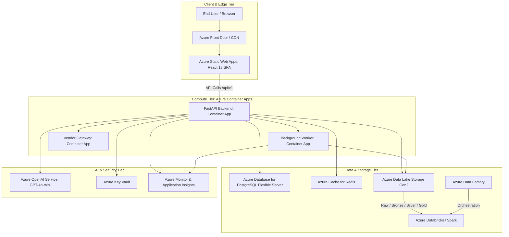

# Azure Cloud Reference Architecture — CarTrust AI

This document details the production Azure Cloud implementation for the CarTrust AI Used-Car Intelligence Platform.

## Architecture Diagram

## Component Mapping

1. **Frontend Hosting**: Azure Static Web Apps
   - Globally distributed content delivery
   - Automated SSL certificate management
   - Zero-downtime deployment previews via GitHub Actions

2. **Application Tier**: Azure Container Apps (Serverless Kubernetes)
   - Microservices: API Service, Celery Worker, Mock Provider
   - Dynamic autoscaling (KEDA) based on HTTP concurrency and Redis queue depth
   - Built-in Dapr integration for secret resolution

3. **Database Tier**: Azure Database for PostgreSQL Flexible Server
   - High availability with Zone-redundant standby
   - Automated daily backups and point-in-time recovery (PITR)
   - Read replicas for high-throughput vehicle lookups

4. **Data Lakehouse Tier**: Azure Data Lake Storage (ADLS Gen2) + Databricks
   - Hierarchical namespace storage: `/bronze`, `/silver`, `/gold`
   - Delta Lake formatting for ACID transactions on vehicle event logs
   - Data quality validation and entity resolution executed via PySpark jobs

5. **AI Services**: Azure OpenAI
   - Private endpoint connectivity
   - GPT-4o-mini deployment for grounded vehicle assistant RAG queries
   - Zero data retention policies enabled

6. **Security & Observability**:
   - Azure Key Vault for database passwords and JWT secrets
   - Application Insights for distributed request tracing, dependency maps, and latency logging
